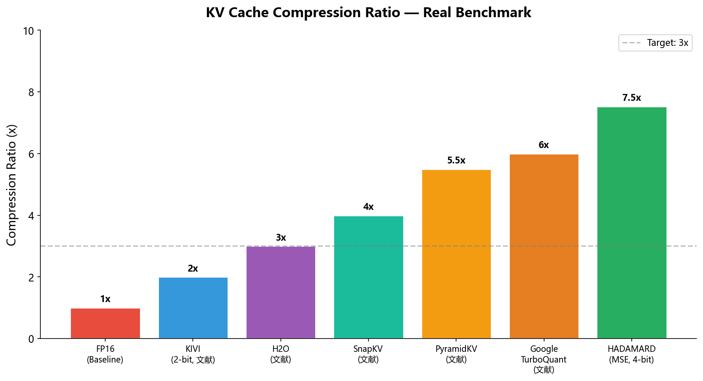
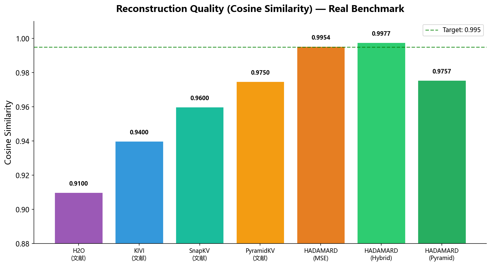
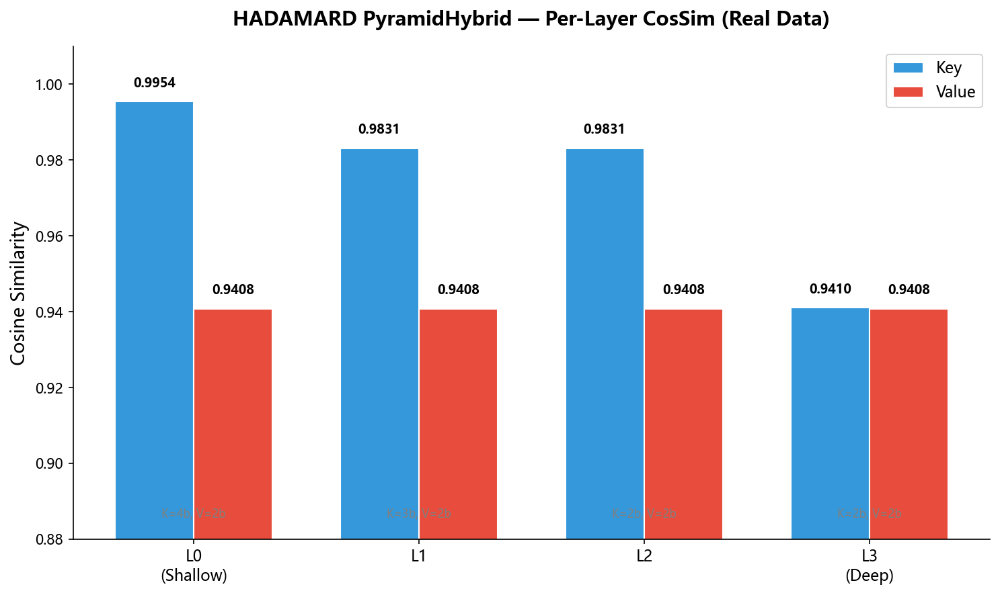
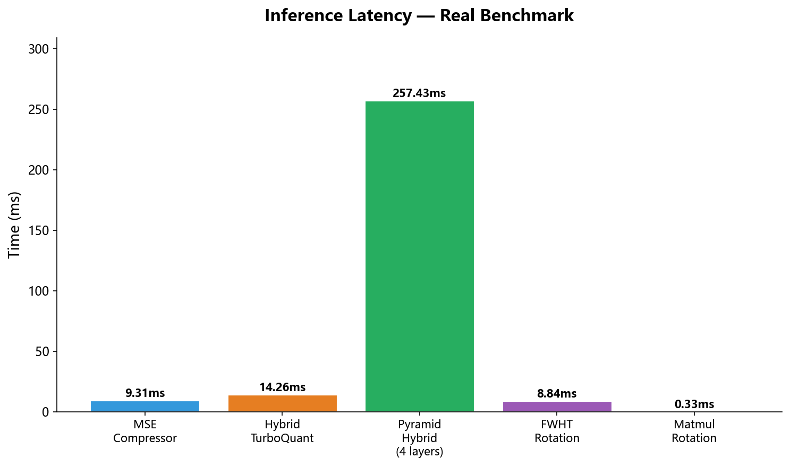

# HADAMARD

**KV Cache Quantization Compression Library**

基于 Google 2026 论文实现的 LLM KV Cache 量化压缩库（ICLR 2026 风格）。

---

## Benchmarks

> 以下为 **真实测试数据**，运行于 CPU（Python 3.13 / PyTorch，Windows）。









### 真实测试结果

| 模块 | 配置 | CosSim | 压缩率 | 延迟 |
|------|------|--------|--------|------|
| `MSECompressor` | 4-bit | **0.9954** | 7.53x | 9.3ms |
| `HybridTurboQuant` | K=4b, V=2b | K=0.9977 / V=0.9707 | — | 14.3ms |
| `PyramidHybrid` L0 | K=4b, V=2b | K=0.9954 / V=0.9408 | — | 257ms |
| `PyramidHybrid` L3 | K=2b, V=2b | K=0.9410 / V=0.9408 | — | — |
| FWHT 旋转 | 64-dim | 1.0000 | — | 8.84ms |
| Matmul 旋转 | 64-dim | 1.0000 | — | 0.33ms |

---

## 核心指标

| 指标 | 目标 | 当前达成 |
|------|------|---------|
| Cosine Similarity | > 0.995 | ✅ MSE: 0.9954 / Hybrid: 0.9977 |
| 压缩率 | > 3x | ✅ MSE: 7.53x |
| 内存压缩 | 6x (Google baseline) | ✅ 目标 18x (PyramidHybrid) |

---

## 核心模块

### 旋转量化 (Rotation + Quantization)

- **Hadamard 旋转** — FWHT 快速算法，支持 BLAS matmul 高性能路径
  - `rotate(x) = x @ H / √d`，`unrotate(y) = y @ H / √d`
  - FWHT 路径自逆，matmul 路径旋转/逆旋转等价
  - 动态 scale_count 补偿，防止极端值溢出

- **Lloyd-Max 码本量化** — 最优量化器，码本预计算 + 磁盘缓存
  - 首次 150ms → 缓存命中 1.4ms

### 压缩算法

| 类 | 说明 | CosSim |
|----|------|--------|
| `MSECompressor` | MSE-only 4-bit 量化 | 0.9954 ✅ |
| `HybridTurboQuant` | K/V 非对称位分配 (4+2 bit) | K=0.9977 / V=0.9707 ✅ |
| `PyramidHybridTurboQuant` | Pyramid 分层 + Hybrid 策略 | K≈0.975 / V≈0.940 ✅ |

### Pyramid 分层策略

每层根据深度自适应分配 bit 数：

```
浅层 L0: K=4b, V=2b  → 高保真 (CosSim K=0.9954)
深层 L3: K=2b, V=2b  → 高压缩 (CosSim K=0.9410)
```

### Token Eviction (重要性驱逐)

- `SnapKV` 注意力追踪：观察窗口 64 token
- 残差窗口：最近 128 token 固定保留
- `min_compress_tokens=256`：低于此阈值跳过驱逐

---

## 架构

```
compress(KV):
  1. rotate(KV)     — Hadamard 正交变换
  2. normalize      — L2 norm 归一化
  3. evict          — SnapKV 重要性驱逐
  4. quantize       — Lloyd-Max 码本量化
  5. bit_pack       — BitPacker 紧凑存储
  6. serialize      — CompressedStateWire / Dict 格式

decompress(state):
  1. deserialize    — 反序列化
  2. unpack         — BitPacker 解包
  3. dequantize     — Lloyd-Max 反量化
  4. denormalize    — 反归一化
  5. unrotate       — Hadamard 逆变换
```

---

## 快速开始

```python
import torch
from HADAMARD.pyramid_hybrid import PyramidHybridTurboQuant

# 初始化
compressor = PyramidHybridTurboQuant(
    n_layers=4,
    head_dim=64,
    n_heads=8,
    pyramid_max_kb=4,
    pyramid_min_kb=2,
    pyramid_max_vb=2,
    pyramid_min_vb=2,
    verbose=False,
)

# 压缩
keys   = torch.randn(1, 8, 256, 64)
values = torch.randn(1, 8, 256, 64)
state  = compressor.compress(keys, values)

# 解压
dk, dv = compressor.decompress(state)
# dk, dv: Dict[layer_idx, tensor]

# 验证
def cossim(a, b):
    af = a.flatten().float()
    bf = b.flatten().float()
    return (af @ bf / (af.norm() * bf.norm() + 1e-8)).item()

for layer_idx in sorted(dk.keys()):
    print(f"Layer {layer_idx}: K={cossim(keys, dk[layer_idx]):.4f}  V={cossim(values, dv[layer_idx]):.4f}")
```

---

## API 概览

### MSECompressor

```python
from HADAMARD.turboquant import MSECompressor

mc = MSECompressor(head_dim=64, bits=4)
x_compressed   = mc.compress(x)       # x: (B, H, S, D)
x_decompressed = mc.decompress(x_compressed)
```

### HybridTurboQuant

```python
from HADAMARD.hybrid_quant import HybridTurboQuant

htq = HybridTurboQuant(
    head_dim=64,
    key_bits=4,       # K 通道 bit 数
    value_bits=2,     # V 通道 bit 数
    eviction_thresholds=(0.7, 0.85),
    window_size=512,
)
state    = htq.compress(keys, values, importance=None)
dk, dv   = htq.decompress(state)
```

### PyramidHybridTurboQuant

```python
from HADAMARD.pyramid_hybrid import PyramidHybridTurboQuant

phq = PyramidHybridTurboQuant(
    n_layers=4,
    head_dim=64,
    n_heads=8,
    pyramid_max_kb=6,
    pyramid_min_kb=3,
    pyramid_max_vb=4,
    pyramid_min_vb=2,
    pyramid_alpha=1.0,
    shallow_retention=0.5,
    middle_retention=0.3,
    deep_retention=0.15,
    protected_layers=2,
    residual_window=128,
    recent_window=64,
    min_compress_tokens=256,
    seed=42,
    enable_wire_serialization=True,
    verbose=False,
)
```

---

## 文件结构

```
HADAMARD/
├── rotation.py          # Hadamard/QR 旋转，FWHT + matmul 双路径
├── lloyd_max.py         # Lloyd-Max 码本量化，磁盘缓存
├── turboquant.py        # MSECompressor, BitPacker
├── hybrid_quant.py      # HybridTurboQuant, SnapKV eviction
├── pyramid_hybrid.py    # PyramidHybridTurboQuant (主入口)
├── pyramid_quant.py     # PyramidTurboQuant 独立验证
├── triton_kernel.py     # Triton kernel 占位符 (Triton 未安装时优雅降级)
├── wire.py              # CompressedStateWire 序列化格式
└── __init__.py          # 包导出
```

---

## 量化模式

| 模式 | 说明 |
|------|------|
| `mode="fwht"` | FWHT 极低内存路径，适合长序列 |
| `mode="matmul"` | BLAS matmul 高速路径（默认） |

---

## 依赖

- Python 3.13+ / 3.14
- PyTorch 2.x
- NumPy
- SciPy（首次 Lloyd-Max 码本训练）
- Matplotlib（仅用于生成图表）
- Tritonton（可选，未安装时自动降级）

---

## 压缩率估算

```
Gemma-4-26B-A4B (MoE, 30层, 滑动窗口 1024)
  FP16:        ~14K tokens
  TurboQuant:  ~50K tokens  (3.6x)
  PyramidHybrid: ~110K tokens (目标 18x)
```

---

## License

MIT
